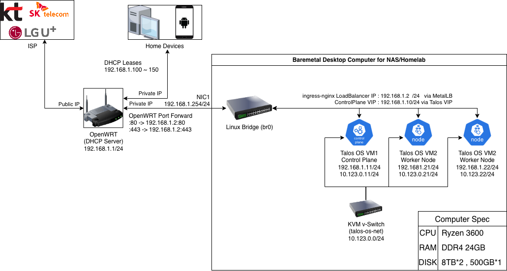

# homelab-k8s

Talos OS를 사용해 홈랩용 Kubernetes 클러스터를 구성하고, 그 과정을 문서와 설정 파일로 남기기 위한 저장소입니다.  
이 프로젝트의 초점은 "집에서 직접 굴려보며 이해하는 학습용 쿠버네티스"에 있습니다. 고가용성보다는 구조를 단순하게 유지하고, 나중에 다시 봐도 같은 흐름으로 재현할 수 있는 형태를 목표로 합니다.

## 프로젝트 개요

- 물리 베어메탈 1대 위에 VM 3대로 클러스터 구성
- `1 x Control Plane`, `2 x Worker`
- OS는 Talos, Kubernetes bootstrap도 Talos 기준으로 진행
- 노드가 실제로 붙는 네트워크와 Kubernetes 논리 네트워크를 분리
- Public Repository를 전제로 문서와 예제 중심으로 정리

이 저장소는 완성된 배포 템플릿이라기보다, 실제 홈랩 환경을 만들면서 얻은 판단과 설정을 점진적으로 정리해 나가는 working repository에 가깝습니다.

## 왜 Talos인가

Talos는 Kubernetes 전용 운영체제라서, 일반적인 리눅스 배포판보다 관리 대상이 훨씬 적고 클러스터 구성 요소에 집중하기 좋습니다.  
학습 관점에서는 다음 장점이 있습니다.

- 운영체제 레이어가 단순해서 Kubernetes 자체에 집중하기 쉽다
- `talosctl` 기반으로 node bootstrap 흐름이 비교적 명확하다
- 설정을 선언형으로 다루기 좋아서 재현성과 문서화에 유리하다

## 현재 목표 아키텍처

| 역할 | 호스트네임 | 관리망 | 노드 내부망 |
| --- | --- | --- | --- |
| Control Plane | `talos-control-1` | `192.168.1.11/24` | `10.123.0.11/24` |
| Worker | `talos-worker-1` | `192.168.1.21/24` | `10.123.0.21/24` |
| Worker | `talos-worker-2` | `192.168.1.22/24` | `10.123.0.22/24` |

- Cluster Name: `homelab-cluster`
- Control Plane Endpoint: `https://192.168.1.10:6443`
- 예시 LoadBalancer / ingress IP: `192.168.1.2`

이 구성은 HA를 강하게 의식한 프로덕션 설계가 아니라, 단일 물리 머신 위에서 Talos와 Kubernetes를 학습하기 위한 실습형 구조입니다.

## 네트워크 설계

이 저장소에서는 네트워크를 크게 두 층으로 나눠서 봅니다.

1. 실제 노드가 붙는 네트워크
2. Kubernetes 내부에서만 쓰는 논리 네트워크

| 구분 | CIDR | 설명 |
| --- | --- | --- |
| 관리망 / 외부 접근망 | `192.168.1.0/24` | Talos 관리 접속, 노드 접근, 외부 서비스 노출 |
| 노드 내부망 | `10.123.0.0/24` | 노드 간 내부 통신, kubelet / etcd / 내부 트래픽 우선 경로 |
| Pod CIDR | `10.244.0.0/16` | CNI가 파드에 할당하는 주소 공간 |
| Service CIDR | `10.96.0.0/12` | Kubernetes Service용 가상 IP 대역 |

핵심은 `10.123.0.0/24`가 "실제 VM이 연결된 내부망"이고, `10.244.0.0/16` 및 `10.96.0.0/12`는 "클러스터 내부 논리망"이라는 점입니다.  
일반적인 홈 데스크탑이나 외부 장비는 Pod CIDR이나 Service CIDR에 직접 붙기보다, 관리망 IP나 LoadBalancer IP를 통해 접근하게 됩니다.

## 토폴로지

현재 구상 중인 네트워크와 노드 배치는 아래 다이어그램과 [`topology/`](./topology) 폴더에서 관리합니다.



- 원본 편집 파일: [`topology/homelab-topology.drawio`](./topology/homelab-topology.drawio)
- 보조 설명 문서: [`topology/README.md`](./topology/README.md)

## 저장소에서 다루는 것

- Talos base config 생성 흐름
- 노드별 patch 파일
- 네트워크와 토폴로지 문서
- bootstrap 이후 첫 사용 절차
- 이후 MetalLB, ingress, 스토리지 등 후속 구성 메모

실제 부트스트랩 및 적용 순서는 [`talos-os/README.md`](./talos-os/README.md)에 단계별로 정리하고 있습니다.

## 현재 상태

- Talos 기본 config 생성 완료
- `controlplane-1`, `worker-1`, `worker-2`용 patch 파일 작성 완료
- bootstrap 및 첫 사용 가이드 초안 작성 완료
- 후속 구성 문서는 점진적으로 추가 예정

## 시작 지점

이 저장소를 처음 보는 사람이라면 아래 순서로 읽는 것을 권장합니다.

1. 이 문서에서 전체 구조를 파악합니다.
2. [`topology/`](./topology)에서 네트워크와 노드 배치를 확인합니다.
3. [`talos-os/README.md`](./talos-os/README.md)에서 Talos 적용 절차를 봅니다.
4. [`talos-os/configs/`](./talos-os/configs)에서 node patch 파일을 참고합니다.

## 저장소 구조

```text
.
|-- AGENTS.md
|-- README.md
|-- talos-os
|   |-- README.md
|   `-- configs
`-- topology
    |-- README.md
    |-- homelab-topology.drawio
    `-- homelab-topology.drawio.png
```

## Public Repo 원칙

이 저장소는 공개 저장소를 전제로 관리합니다.

- 개인 키, 인증서, kubeconfig, token, secret은 커밋하지 않습니다.
- 생성 결과물과 민감 산출물은 `.gitignore`로 제외합니다.
- 가능한 경우 실제 민감값 대신 예시 또는 문서화된 절차를 남깁니다.
- 네트워크, 호스트네임, 설정 흐름이 바뀌면 관련 문서를 함께 갱신합니다.

## 앞으로 보강할 내용

- Talos 적용 후 검증 절차 정리
- CNI 선택 및 동작 메모
- MetalLB / ingress-nginx 구성 기록
- 스토리지 연동 메모
- 처음부터 따라 할 수 있는 newcomer-friendly 가이드

## 참고 문서

- Talos bootstrap 메모: [`talos-os/README.md`](./talos-os/README.md)
- 토폴로지 자료: [`topology/`](./topology)
- 작업 기준 문서: [`AGENTS.md`](./AGENTS.md)
